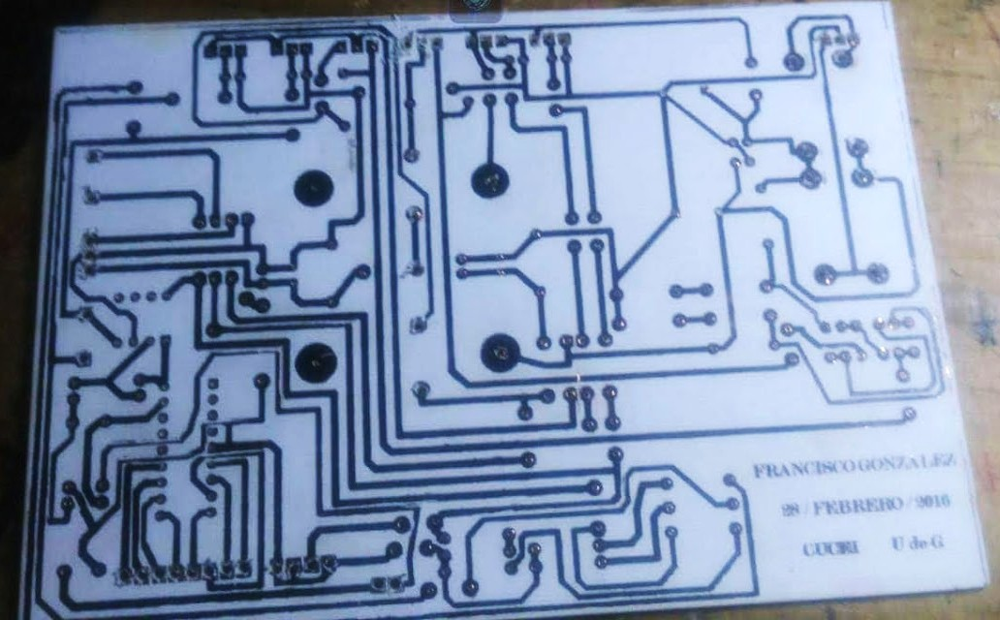
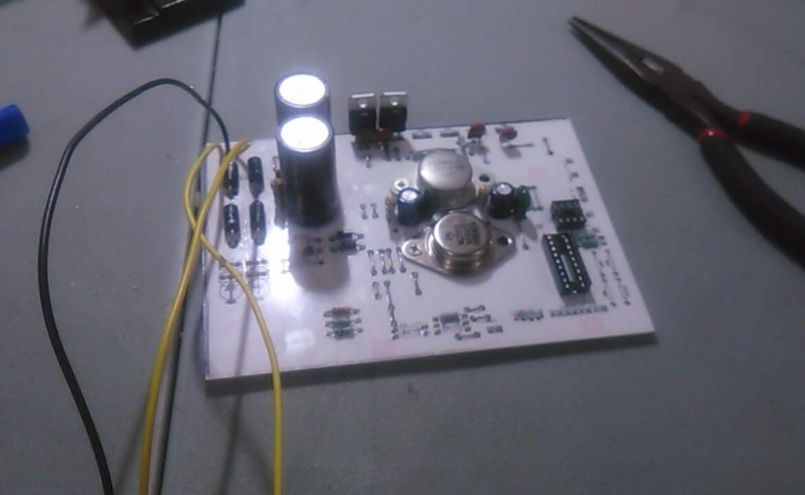
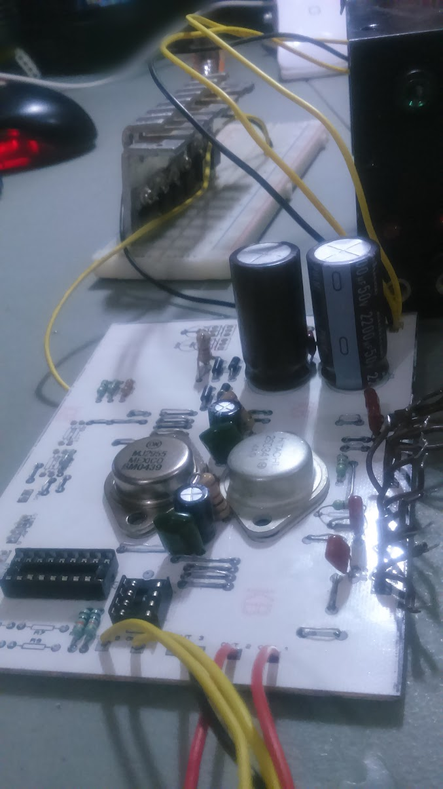
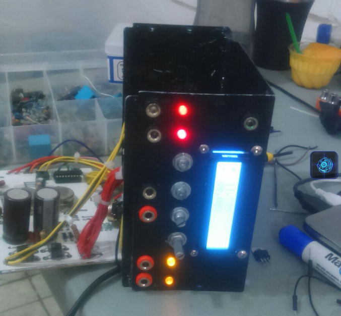
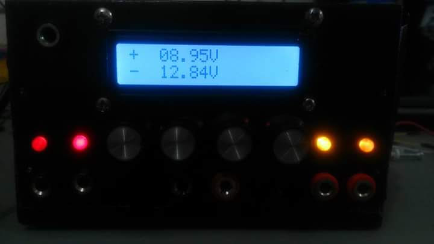
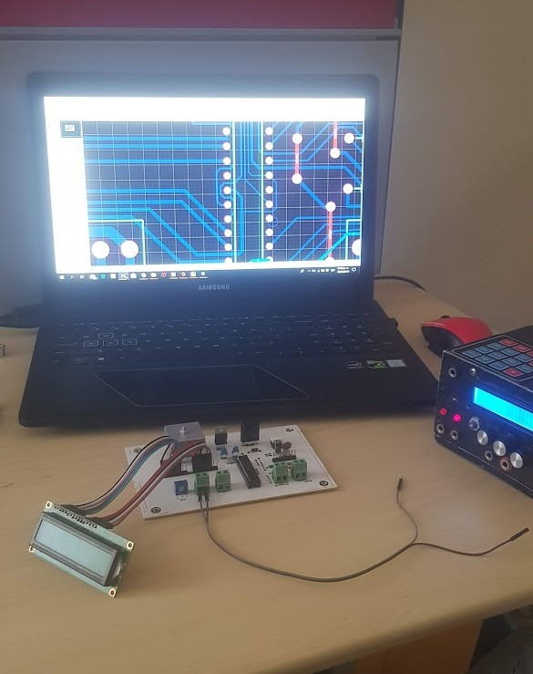
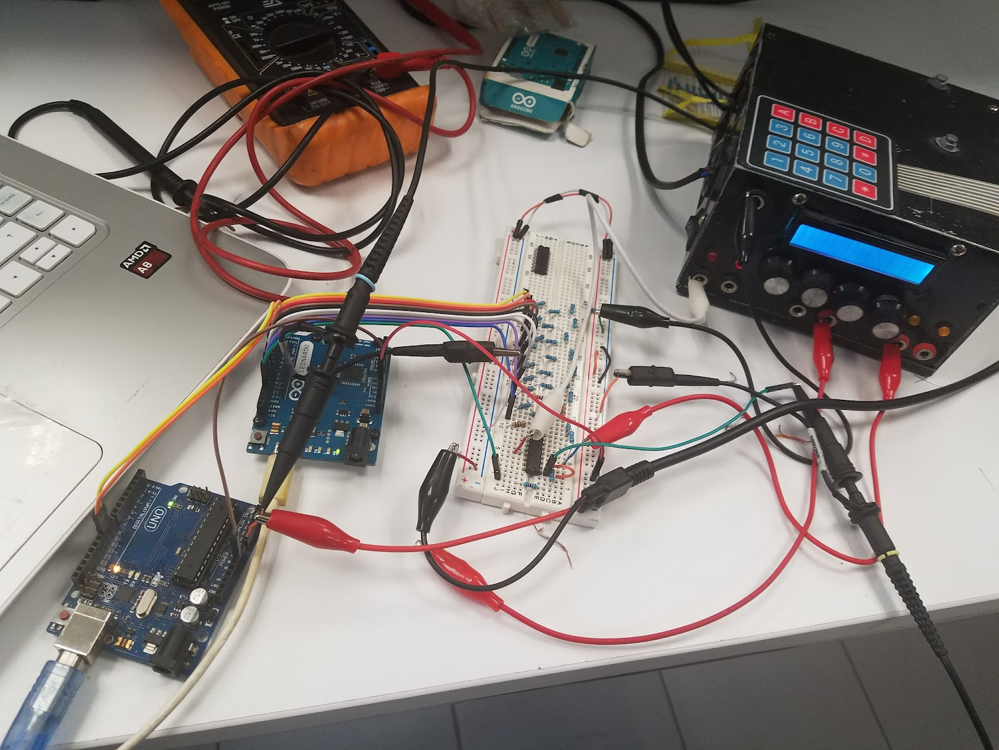

# Bench Dual Power Supply ±24 V / +5 V / +12 V @ 1 A  
A linear bench power supply I designed and built at the beginning of my Electronics Engineering degree.  
This unit powered *almost every project and lab* I did during my years at university.

> Adjustable dual-rail supply (±24 V), plus fixed +5 V and +12 V rails.  
> Designed for analog circuits, microcontrollers, audio stages, and general prototyping.

---

## ✨ Features

- **Adjustable Outputs**
  - **±1.5 V to ±24 V** dual linear outputs  
- **Fixed Outputs**
  - **+5 V** (fixed)
  - **+12 V** (fixed)
- **Maximum current:** 1 A per output  
- **Low-noise** linear topology  
- **LCD voltage monitoring** (shows positive and negative rails simultaneously)  
- **Front-panel interface**  
  - Banana terminals for each rail  
  - Adjustment potentiometer for ±24 V rails  
  - LED indicators for active outputs  

---

## 🖼️ Image Gallery

### Prototyping Phase

### PCB Fabrication & Assembly

### Final Unit

---

## ⚙️ System Architecture

The power supply is divided into the following functional blocks:

### 1. Transformer & Rectification
- Center-tapped transformer for dual-rail generation  
- Full-wave rectification  
- High-value electrolytic capacitors for ripple reduction  

### 2. Linear Regulation
- Adjustable ±24 V rails using TO-3 pass transistors  
- Fixed regulators (78xx series) for +5 V and +12 V  
- Heat-sinked power devices designed for up to 1 A load  

### 3. Voltage Monitoring
- Microcontroller (Arduino-based) to read rail voltages  
- Voltage dividers to scale the rails to ADC range  
- 16×2 LCD for real-time voltage display  

### 4. Front-Panel Controls
- Banana connectors for each rail  
- LEDs indicating rail availability  
- Potentiometer for voltage adjustment  

---

## 📐 Electrical Specifications

| Parameter                   | Value                         |
|-----------------------------|-------------------------------|
| Adjustable rails            | ±1.5 V → ±24 V                |
| Fixed rails                 | +5 V / +12 V                  |
| Current rating              | 1 A per rail                  |
| Regulation type             | Linear                        |
| Ripple (approximate)        | Low (suitable for audio/analog) |

---

## 🛠️ Design Process

- Designed schematic manually, later transferred to PCB software  
- Calculated:
  - Required rectifier and transformer ratings  
  - Ripple voltage based on capacitor size  
  - Thermal dissipation for the TO-3 pass transistors  
  - Voltage-divider ratios for ADC readings  
- Designed as a **single-layer PCB**, manufactured using home etching  
- Hand-drilled, soldered, and tested with resistive loads and real circuits  

---

## 🔬 Testing & Validation

Tested the supply in multiple scenarios:

- Load testing at 1 A  
- Thermal behavior of pass transistors  
- Voltage stability under varying loads  
- Oscilloscope measurement of ripple and transients  
- Real-world use powering:
  - Microcontrollers (Arduino, PIC)  
  - Analog stages and op-amp circuits  
  - Audio amplifiers  
  - Filters, sensors, digital logic experiments  

---

## 📚 What I Learned

Building this supply taught me:

- Dual-rail linear regulator design  
- Safe handling of mains transformers  
- Discrete power electronics (TO-3 pass transistors)  
- PCB design and home fabrication techniques  
- Integrating analog circuitry with digital monitoring  
- Thermal design & component derating  

---

## 🚀 Future Improvements

If I redesigned this today, I would add:

- Adjustable current limiting  
- Built-in current measurement  
- Better protection (over-current, thermal shutdown, crowbar)  
- Professional two-layer PCB  
- USB/serial logging of voltage & current  
- Switching preregulator for higher efficiency  

---

## 📁 Repository Structure

